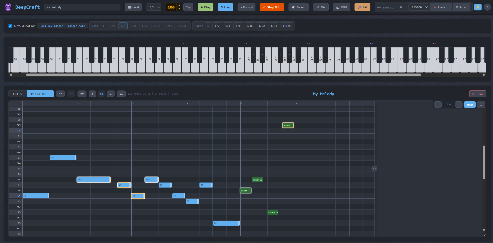
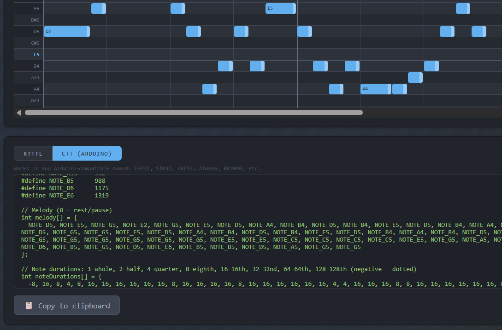
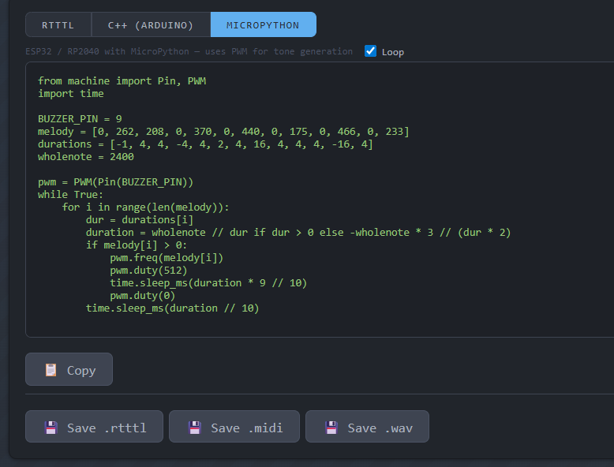
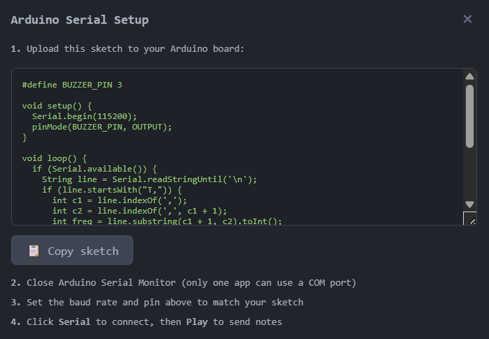
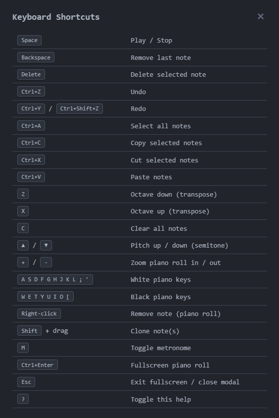

<div align="center">

# 🐝 BeepCraft

**Browser-based melody composer for Arduino buzzers**

Create melodies with a piano keyboard and piano roll editor, then export as Arduino C++ code or RTTTL notation.

[](https://mrotnik.github.io/beepcraft/)

*Single file · No install · Works offline · Works from `file://`*

</div>

---



## ✨ Features

<table>
<tr>
<td width="50%">

### 🎵 Compose
- 🎹 **Piano keyboard** — mouse, touch, or computer keys
- 🎼 **Piano roll editor** — drag, resize, clone, multi-select
- 🧩 **Chip view** — simplified horizontal display
- ⏺️ **Recording mode** — auto-detect duration from key hold
- 🎶 **57 preset melodies** — search and load classic tunes

</td>
<td width="50%">

### 📤 Export
- 📟 **Arduino C++** — `tone()`/`noTone()` for any board (ESP32, STM32, RP2040, ATmega, etc.)
- 📱 **RTTTL** — standard ringtone format, paste/drop to import
- 🎵 **MIDI export** — download as Standard MIDI file
- 🔌 **Serial upload** — send directly to Arduino (Chromium)
- 🔗 **Share links** — shareable URL with encoded melody

</td>
</tr>
<tr>
<td>

### 🎛️ Input
- 🎛️ **MIDI keyboard** — plug and play
- 🎹 **MIDI file import** — drop monophonic .mid files to load melodies
- 📂 **Audio import** — extract melody from WAV/MP3/OGG
- 🎙️ **Mic recording** — real-time pitch detection

</td>
<td>

### ⚡ Playback & UX
- ▶️ **Playback** — loop, metronome, tap tempo, time signatures
- ↩️ **Undo/redo** — copy/paste, octave transpose
- 🌗 **Dark/light theme**
- 📁 **Zero dependencies** — no server needed

</td>
</tr>
</table>

## 🚀 Quick Start

```bash
# Option 1: Use online
# Visit https://mrotnik.github.io/beepcraft/

# Option 2: Run locally
git clone https://github.com/mrotnik/beepcraft.git
# Open beepcraft.html in your browser
```

1. Play notes on the keyboard or piano roll
2. Copy the generated Arduino code
3. Upload to your board

### 🔌 Arduino Wiring

Connect a passive buzzer between any GPIO pin (default: pin 5) and GND, with VCC to 3.3V or 5V. The generated code uses the standard `tone()` API.

## 📸 Screenshots

<details>
<summary>Click to expand</summary>









</details>

## 🛠️ Development

Plain HTML/JS/CSS with zero dependencies. Source files are modular:

```
js/          16 modules (state, constants, audio, audio-import, rtttl, codegen, ui, ...)
css/         6 stylesheets (base, controls, keyboard, piano-roll, chips, dark)
melodies/    57 RTTTL preset files
index.html   main HTML
bundle.py    build script
```

### Build

```bash
python bundle.py
```

Concatenates all JS/CSS, inlines melody presets, and produces `beepcraft.html` — a single self-contained file.

### Architecture

All JS modules attach to the `window.MP` namespace (no ES modules, no bundler toolchain). Files are concatenated in dependency order by `bundle.py`.

Notes are stored as timeline objects `{ name, freq, start, dur }` where `start` and `dur` are in beats (quarter note = 1 beat).

> **Note:** Edit files in `js/`, `css/`, and `index.html` — never edit `beepcraft.html` directly.

## 🙏 Credits

- Preset melodies from [rtttl.js](https://github.com/1j01/rtttl.js) by Isaiah Odhner (MIT License)

## 📄 License

[GNU GPLv3](LICENSE)
